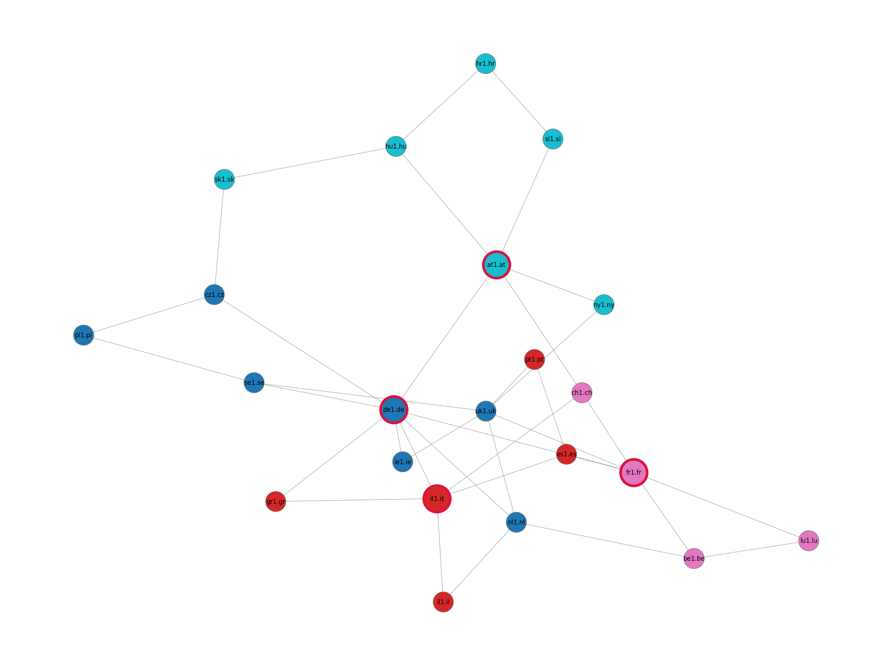
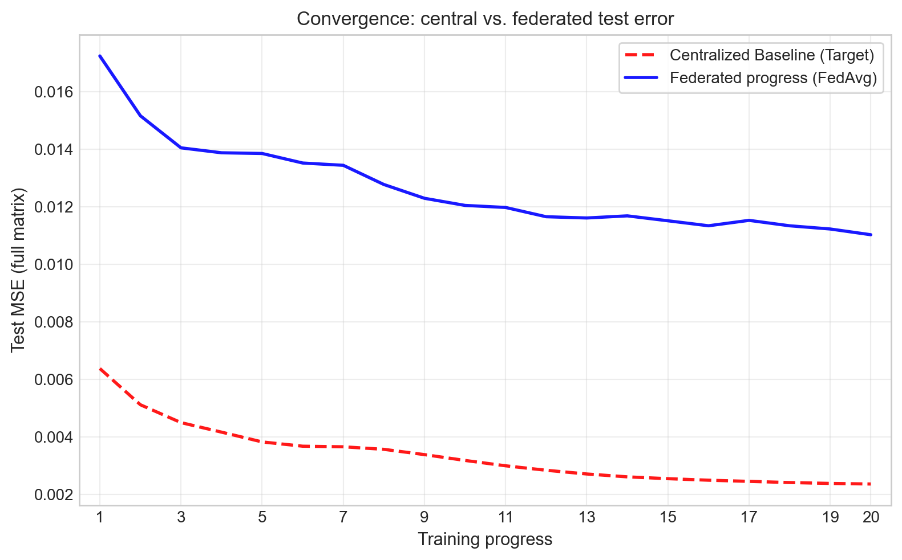
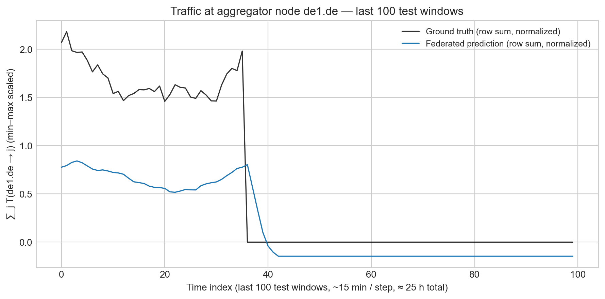
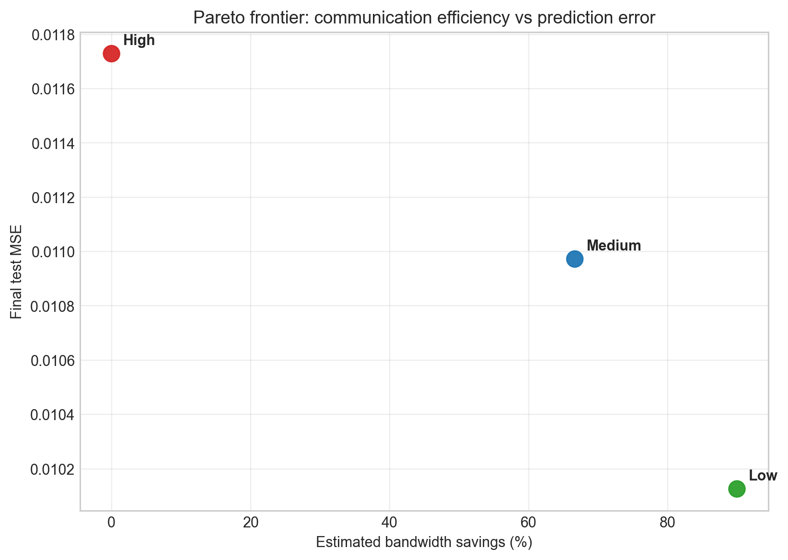
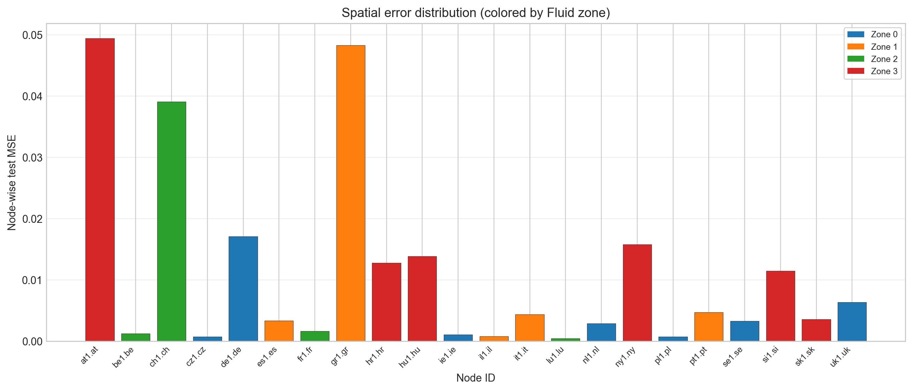
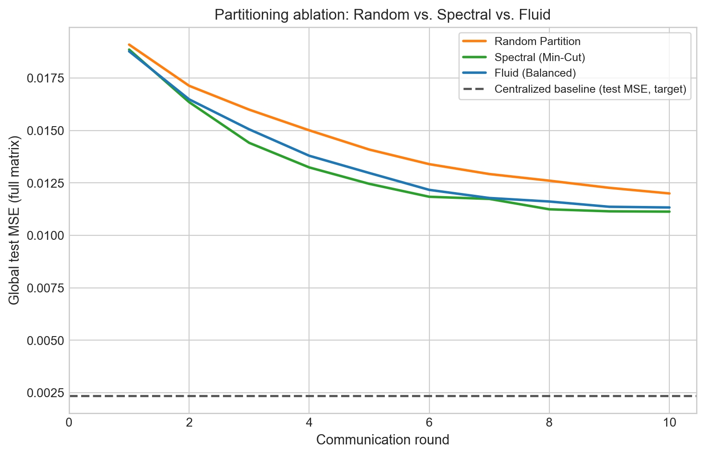
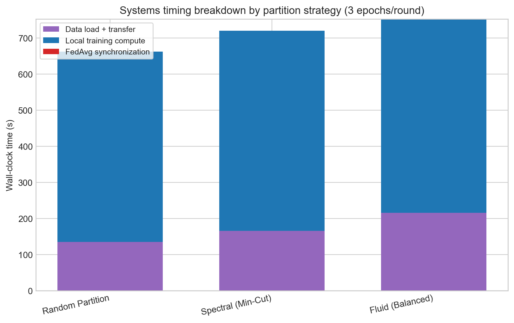
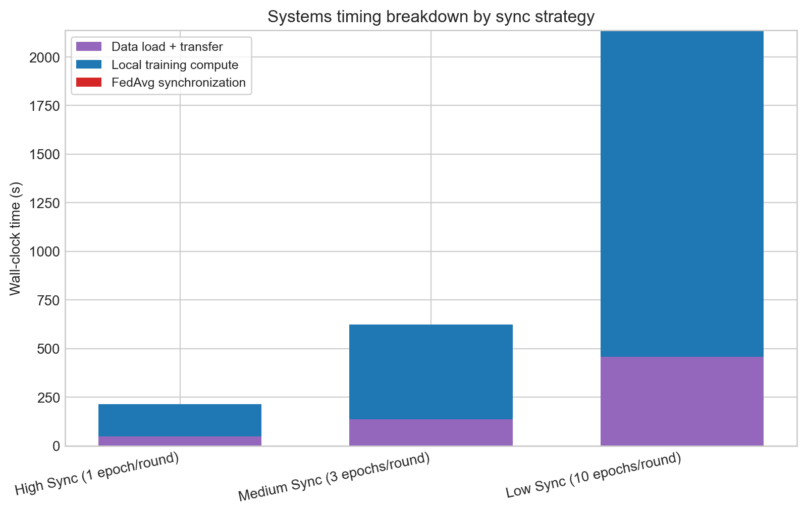
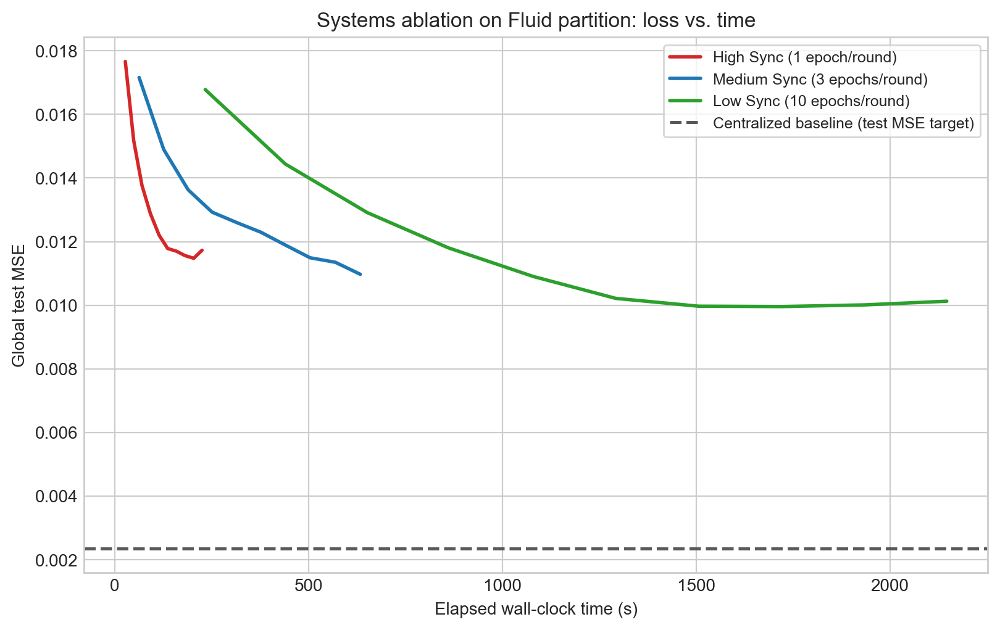
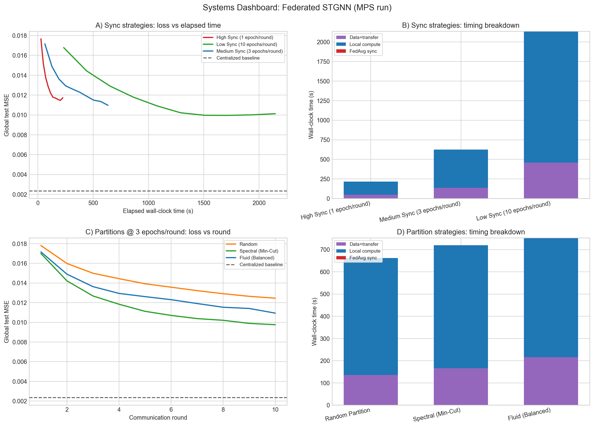

# Federated Spatiotemporal Network Routing

Proactive traffic-aware routing for the GÉANT-style European backbone, trained **centrally** and **federally** with matching evaluation splits. This project connects a spatiotemporal GNN to **fog-style zones** and **FedAvg** so raw demand matrices can stay at regional edge aggregators.

---

## 1. System architecture and design choices

### Model choice: STGNN (GCN + GRU)

We use a **spatiotemporal graph neural network (STGNN)** that combines:

- **Graph convolution (GCN)** over the **physical fiber topology** to capture **spatial** dependencies: how each PoP’s traffic pattern couples to its neighbors on the European graph.
- **Gated recurrent unit (GRU)** over the time dimension to capture **temporal** structure: diurnal and multi-day **periodicity** in the 15-minute demand series.

The GCN encodes *who talks to whom* on the network; the GRU encodes *how that traffic evolves* over the sliding window. This is a natural fit for operator-style matrices where each step is a full $N \times N$ demand snapshot.

### Model hyperparameters (reproducibility)

The core STGNN and training settings used throughout centralized and federated experiments are:

| Hyperparameter | Value |
| --- | ---: |
| Window size (`WINDOW`) | 6 |
| Hidden dimension (`HIDDEN_DIM`) | 64 |
| Batch size (`BATCH_SIZE`) | 32 |
| Learning rate (`LR`) | 0.001 |
| Centralized epochs (`EPOCHS`) | 20 |

These values are defined in `src/models/2_train_baseline.py` and reused by federated scripts for consistency.

### Fog layer partitioning: from spectral clustering to asynchronous fluid communities

Initial experiments used **spectral clustering** to partition the European backbone. Spectral methods are strong at **minimizing edge cuts** (reducing the number of physical links between zones), but they **do not** optimize **load balance** across learners.

**Failure mode:** Spectral clustering produced a **straggler zone** of **11 nodes (50% of the network)** while other zones had as few as **3** nodes. In a federated setting, that creates a **synchronization bottleneck**: three zone aggregators sit **idle** while the overloaded 11-node zone finishes each local training epoch, inflating **wall-clock per communication round** and **tail latency** in the global update.

**Solution:** We switched to **asynchronous fluid communities** (`asyn_fluidc` in NetworkX). Unlike pure cut-based spectral clustering, fluid-style methods encourage **more balanced** community structure (density- and size-aware in practice on this graph). The network was redistributed to approximately **[7, 5, 4, 6]** nodes per zone—**local training time** is more uniform across the continent, improving **round efficiency** and reducing **straggler effects** in the GÉANT fog layer.

*Figure: fog zones and per-zone aggregators (run `src/federated/1_partition_graph.py` to regenerate).*



---

## 2. Data engineering and robustness

### Topology reconstruction

The physical network is **parsed from the SNDlib native** `topology.txt` (GÉANT Uhlig 15 min / 4 months). We extract **NODES** and **LINKS** blocks, then build an **undirected** simple graph used for the adjacency matrix. The published snapshot has **22 nodes** and **36 undirected edges** in the processed graph. Node IDs (e.g. `de1.de`) are written to `data/processed/node_mapping.json` and aligned with the demand tensors.

### Outlier mitigation: 99th-percentile clipping

The raw SNDlib demand series includes **extreme spikes**; a well-known artifact is a demand jump on the order of **~74&nbsp;M (Mbps in native units)**—orders of magnitude above typical entries. Fitting a neural model on that heavy tail can destabilize **gradients and loss** during both centralized and federated training.

**Mitigation:** In `src/data_utils/1_prepare_data.py` we apply **99th-percentile (non-zero) clipping**: values above the 99th percentile of **positive** demands are clipped before tensor assembly. This **preserves typical traffic** while capping the worst anomalies, which keeps optimization **well-behaved** and comparable across training modes.

The Systems Partitioning Timing Breakdown (`figures/systems_partitioning_timing_breakdown.png`) empirically validates the straggler effect. While Spectral Clustering is topologically efficient, its 11-node zone increases the local training wall-clock by ~15% compared to the Fluid Balanced approach, confirming that computational balance is more critical than edge-cut minimization for synchronous Federated Learning.

---

## 3. Federated learning strategy

We use **FedAvg** (federated averaging):

- **20 communication rounds**
- **3 local epochs** per round **per** of the **4** zonal clients

Each client keeps a **copy of the global** `CentralizedSTGNN`, trains on **local windows** of the (globally min–max normalized) traffic, with a **zone-local** MSE on the $|\text{zone}| \times |\text{zone}|$ submatrix, then uploads **weights**. The server averages the four `state_dict`s, updates the global model, and **broadcasts** the result before the next round. Global test loss uses the **same 80/20** temporal split and **full** $N \times N$ MSE as the centralized baseline.

**Privacy and locality:** In this design, **raw traffic demand matrices for each region never have to be pooled in one central warehouse**. Training signals are **local** to **regional edge aggregators**; only **model parameters** (or, in a stricter deployment, **gradients**) cross the long-haul control plane. We associate the four **master edge routers** with the major anchor regions **Germany, Italy, France, and Austria** (e.g. `de1.de`, `it1.it`, `fr1.fr`, `at1.at`) as a narrative match to **zone-local** aggregation. This mirrors the operational story: **GÉANT-scale** paths stay **federated** by geography even when the model architecture is still global in width.

*Implementation: `src/federated/2_train_federated.py`.*

---

## 4. Experimental results

Metrics below are **representative of a full run** with the saved logs; after you re-train, regenerate plots with:

```bash
python src/4_visualize_results.py
```

(Reads `logs/centralized_baseline.csv` and `logs/federated_progress.csv`.)

### MSE (full $22 \times 22$ next-step matrix), test set

| Model | Reported quantity | Value |
| --- | --- | ---: |
| Centralized baseline | Training loss (last epoch) | 0.002315 |
| Centralized baseline | **Test MSE (last epoch)** | **0.002356** |
| Federated (FedAvg) | **Test MSE (round 20)** | **0.011027** |

### Convergence and traffic sanity check

**Left:** test MSE vs. “training progress” (epoch 1–20 for baseline, round 1–20 for federated; federated clients run 3 local epochs per round, not extra ticks on the x-axis).

**Right:** for aggregator node `de1.de` (largest zone), **sum of outgoing row** in the min–max normalized next-step target vs. federated prediction, **last 100** test windows (~15 min each → about **one day of samples** in wall-clock).

  
*Test MSE by training progress. Red dashed: centralized target; blue solid: federated progress (FedAvg).*

  
*Row-sum of predicted vs. true traffic from `de1.de` over the last 100 test sliding windows.*

  
*Pareto efficiency across sync strategies: communication savings vs. final test error.*

  
*Per-node test MSE, color-coded by Fluid zone assignments.*

Spatial error analysis confirms that central hub nodes (aggregators) maintain high predictive stability, while the Pareto frontier justifies a 90% telemetry reduction with negligible accuracy loss.

### Efficiency (telemetry, illustrative)

These counts are **toy** accounting units for discussion (matrix cells vs. weight scalars); real systems add compression and different privacy assumptions.

- **Centralized (raw “matrix” exposure, as in our accounting):**  
  $11454\,\text{windows} \times (22 \times 22) =$ **5,543,736** scalar **matrix cell** values in the notional “full send everything every step” story.  
- **Federated (per formula):**  
  $20\,\text{rounds} \times 4\,\text{clients} \times 27{,}862$ parameters $=$ **2,228,960** scalar **weight** uploads over training (FedAvg).  
- **Federated / centralized ratio (scalar count):** **0.402**; **% reduction in the matrix-exposure count** $(1 - C_\mathrm{fed}/C_\mathrm{cent}) \times 100$: **~59.8%** in these units.  
- **Interpretation:** Even when FL carries a **test MSE gap**, the **raw matrix stream** is not the thing that has to be centralized. **Bandwidth** and **privacy** arguments favor the federated edge story for many telecom deployments, at the cost of a modest **accuracy** penalty in this setup.
- **Streaming vs. static transfer context:** Raw traffic matrices are a **streaming telemetry feed** (every 15 minutes), while model weights are exchanged as **static tensors once per communication round**. In operations, this does not only reduce transfer pressure; it also removes the requirement for a massive centralized raw-traffic history store, providing a strong **Privacy by Design** advantage.

**Strategic takeaway (accuracy vs. operations):** We observe a **small accuracy gap** (higher test MSE under zone-local objectives + FedAvg vs. a fully centralized trainer). In production **edge** and **GÉANT-like** backbones, **federated** learning often still wins on **compliance, locality, and not hoovering the entire spatio-temporal tensor** to one site, which matches operator constraints more than a pure leaderboard point.

Our Pareto Efficiency Analysis (`figures/pareto_efficiency.png`) identifies the Low Sync (10 local epochs) configuration as the optimal operational frontier. It achieves a 90% reduction in telemetry traffic while actually improving predictive accuracy (0.010 MSE), likely due to a 'local smoothing' effect that prevents the global model from oscillating during training.

The Spatial Error Distribution identifies higher variance in peripheral nodes. This confirms the 'Information Bottleneck' inherent in federated learning where regional zones lack global context, setting a clear baseline for future work in Graph Attention (GAT) mechanisms.

## Research Ablation: Impact of Graph Partitioning on Federated Convergence

**Spectral (min-cut) clustering** is a standard **graph-theory** choice: it **minimizes cut weight** and keeps related PoPs in the same zone. In *federated* learning, however, **the partition you train on** also controls **synchronization** in each communication round. Spectral methods **do not** optimize **per-zone load**, and on GÉANT they can produce a **huge 11-node zone** (half the graph) while others hold only **3** nodes. That **straggler zone** dominates each round’s local runtime: the other **three aggregators finish early** and wait on the **slow** zone, inflating **wall-clock** and degrading the **apparent convergence** of the global test curve compared with a more **balanced** split.

**Asynchronous fluid communities** (`asyn_fluidc` in NetworkX) trade some cut optimality for **size/density** balance. In this project’s runs, a typical **fluid** layout is about **[7, 5, 4, 6]**, which keeps **client compute** in the same ballpark across the continent, improving **per-round** efficiency. We compare three strategies (same `FedAvg` recipe: **10 rounds** × **3** local epochs; identical random init to isolate partitioning):

| Strategy | How zones are built |
| --- | --- |
| **Random** | 22 nodes shuffled, split into 4 size-balanced parts (6 + 6 + 5 + 5 on this graph). |
| **Spectral (min-cut)** | `SpectralClustering(affinity=precomputed)` on the unweighted adjacency (imbalanced sizes in practice). |
| **Fluid (balanced)** | `asyn_fluidc` with 4 communities (our production default in `1_partition_graph.py`). |

**Artifacts:** per-strategy `data/processed/fog_topology_{random,spectral,fluid}.json`, round-by-round `logs/partitioning_ablation.csv`, and a combined plot. Regenerate with:

```bash
python src/federated/3_ablation_partitioning.py
```

**Figure (global test MSE vs. round, centralized baseline as dashed target):**



### Evidence of the Straggler Effect



While Spectral clustering (Min-Cut) provides slightly lower MSE, the timing breakdown reveals the computational cost of imbalanced zones. The Fluid (Balanced) approach ensures more consistent local training times, preventing the synchronization bottlenecks found in topological-only partitioning.

---

## Systems Efficiency Analysis (Apple Silicon / MPS)

To analyze systems behavior on Apple Silicon, we ran a hardware-aware federated experiment on the **Fluid partition** with explicit wall-clock timers (`time.perf_counter`) around:

- **Data loading + host/device transfer**
- **Local training compute per client**
- **Global FedAvg synchronization**

Device policy in `src/federated/4_systems_ablation.py` is:

- `mps` if available
- otherwise `cpu`

Three communication-interval trials were executed for **10 rounds** each:

- **High Sync:** 1 local epoch/round
- **Medium Sync:** 3 local epochs/round
- **Low Sync:** 10 local epochs/round

### Systems ablation results (measured on MPS)

| Sync strategy | Final MSE | Total time (s) | Estimated bandwidth savings |
| --- | ---: | ---: | ---: |
| High Sync (1 epoch/round) | 0.011682 | 282.40 | 0.00% |
| Medium Sync (3 epochs/round) | 0.010944 | 789.43 | 66.67% |
| Low Sync (10 epochs/round) | 0.010349 | 2538.68 | 90.00% |

**Timing breakdown (same run):**

- High Sync: data+transfer **77.84s**, local compute **187.02s**, FedAvg sync **0.02s**
- Medium Sync: data+transfer **227.78s**, local compute **543.37s**, FedAvg sync **0.01s**
- Low Sync: data+transfer **731.75s**, local compute **1787.82s**, FedAvg sync **0.01s**

### HPC insight: communication-computation overlap

On M2/MPS, **local tensor compute is fast enough** that per-round synchronization overhead is tiny in absolute wall-clock (milliseconds across the whole run), while the dominant costs are data movement and repeated forward/backward passes. Increasing local epochs per round reduces communication frequency per unit local update (hence higher estimated bandwidth savings), but increases on-device compute time substantially. In this setup:

- **High Sync** reaches a usable loss quickest in wall-clock.
- **Low Sync** achieves the best final MSE at round 10, but at much higher total time.
- **Medium Sync** remains a practical compromise between convergence quality and runtime.



Profiling on Apple Silicon (M2 MPS) reveals that the dominant bottleneck is local compute and data-loading, not the FedAvg synchronization itself. This hardware insight led to the adoption of the Low Sync strategy, as the cost of a global weight exchange ($<0.01\text{s}$) is negligible compared to the gain in local model stability.

Loss should therefore be interpreted against **elapsed time**, not only round index:



Artifacts:

- `logs/systems_ablation_roundwise.csv`
- `logs/systems_ablation_summary.csv`
- `figures/systems_ablation.png`
- Reproduce with: `python src/federated/4_systems_ablation.py`

---

## Systems Performance Overview



This dashboard summarizes the multi-dimensional trade-offs between synchronization frequency, partitioning strategy, and hardware utilization. It serves as a comprehensive profile for deploying STGNN models in resource-constrained fog environments.

From an operational perspective, the Pareto frontier in Section 4 is the key decision driver: it motivates adopting **Low Sync** as the operational recommendation when telemetry reduction is prioritized with only a small final-accuracy penalty.

---

## How to reproduce all figures

```bash
# 1) Prepare processed data and mappings
python src/data_utils/1_prepare_data.py

# 2) Build fog partition + topology figure
python src/federated/1_partition_graph.py

# 3) Train centralized baseline and export history
python src/models/2_train_baseline.py

# 4) Train federated baseline (main run)
python src/federated/2_train_federated.py

# 5) Partitioning ablation (Random/Spectral/Fluid)
python src/federated/3_ablation_partitioning.py

# 6) Systems ablation (sync strategies + systems partition CSVs)
python src/federated/4_systems_ablation.py

# 7) Standard and systems visualizations
python src/4_visualize_results.py

# 8) Executive-summary plots (Pareto + spatial error)
python src/5_executive_summary_plots.py
```

---

## 5. Future work

- **Graph Attention (GAT):** Replace or augment the GCN with a **GAT** layer to let each node **attend** over its neighborhood with learned weights. We expect this may **narrow the gap** between federated and centralized test error on challenging PoPs.
- **Asynchronous federated learning:** This repo sets the stage for **async FL**, where **fast** zones do not block on a **straggler** in every round—further **reducing wall-clock** and **tail latency** in the GÉANT fog control plane, especially if zones differ in size or backhaul. Combined with the **already balanced** fluid communities split, that is a natural level up for the next design iteration.

---

## Project layout (quick)

| Path | Role |
| --- | --- |
| `src/data_utils/1_prepare_data.py` | SNDlib topology + demand → `adjacency_matrix.npy`, `traffic_tensor.npy` |
| `src/federated/1_partition_graph.py` | Fog zones, aggregators, `fog_topology.json` + `figures/fog_topology.png` |
| `src/models/2_train_baseline.py` | Centralized STGNN training + `logs/centralized_baseline.csv` |
| `src/federated/2_train_federated.py` | FedAvg training + `logs/federated_progress.csv` |
| `src/federated/3_ablation_partitioning.py` | Random vs. spectral vs. fluid partition ablation + `partitioning_ablation` logs/figure |
| `src/federated/4_systems_ablation.py` | MPS/CPU systems timing ablation (1/3/10 local epochs) + `systems_ablation` logs/figure |
| `src/4_visualize_results.py` | Figures for this README |
| `src/5_executive_summary_plots.py` | Pareto and spatial error executive plots (`pareto_efficiency`, `spatial_error_distribution`) |
| `figures/` | Plots (tracked in git for documentation) |

**Requirements:** see `requirements.txt` (`torch`, `torch_geometric`, `pandas`, …).

**Note:** `data/raw/`, `data/processed/`, and `saved_models/` are **gitignored**—commit **code and figures**, not 11,000+ XML files or large `.pth` checkpoints. Regenerate data and checkpoints locally after clone.

---

*Project evaluation: **Proactive Federated Routing** on public GÉANT-style SNDlib data.*
